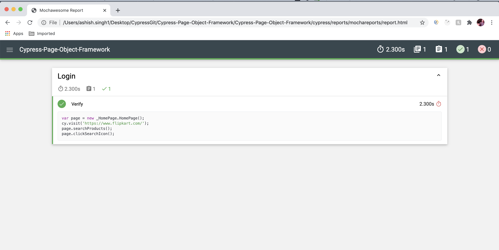

# Cypress-Page-Object-Framework
Cypress page object model automation framework using cypress, Javascript.

**Installing Cypress**

Install Cypress via npm:
```bash
cd /your/project/path
npm install cypress --save-dev
```

**Installing Cypress Xpath **

```bash
cd /your/project/path
npm install -D cypress-xpath
```
After Installing add below line in **support/index.js** file
```bash
require('cypress-xpath')
```

## Steps to Setup

**1. Clone the application**
```bash
git clone https://github.com/Ashishjublsdet/Cypress-Page-Object-Framework.git 
```
**2.Go to project Directory**
```bash
cd Cypress-Page-Object-Framework
```
**3.Run **
```bash
npm run test
```


**Configure test in Cypress **

```bash
Add below line in Cypress.json and you can change you test location 

{"integrationFolder":"cypress/Tests"}
```

## Project Structure
### Package & Classes Details 


##### Pages :  In this package all the pages of application is present.
HomePage

##### Tests :  In this package all the TestCases is present.
TestCase

**Integrated Mocha Framework for Reporting**


